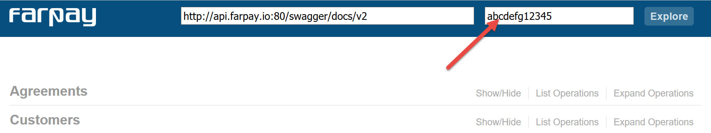

[Root](../Readme.md) / Common

# Common for all requests

All requests must comply to following terms.

| Term    | Description                                                                                                                                                                          | 
|---------|--------------------------------------------------------------------------------------------------------------------------------------------------------------------------------------|
| API Key | A key - the identifyer, that is added to the header of each request in FarPay API                                                                                                    |
| Accept  | The accept term in the header, asks the API to deliver the results in a given format. <br/>Available formats are:<ul><li>`application/json`</li><li>`application/xml`</li></ul> |


## Header annotation 
With the given terms, the following header shows the two values, `X-API-KEY` and the `Accept` values.

```
X-API-KEY: abcdefg1234567
Accept: application/json
```

# Api Key input in swagger
Navigate to swagger GUI https://api.farpay.io/swagger, and input the requested API key


