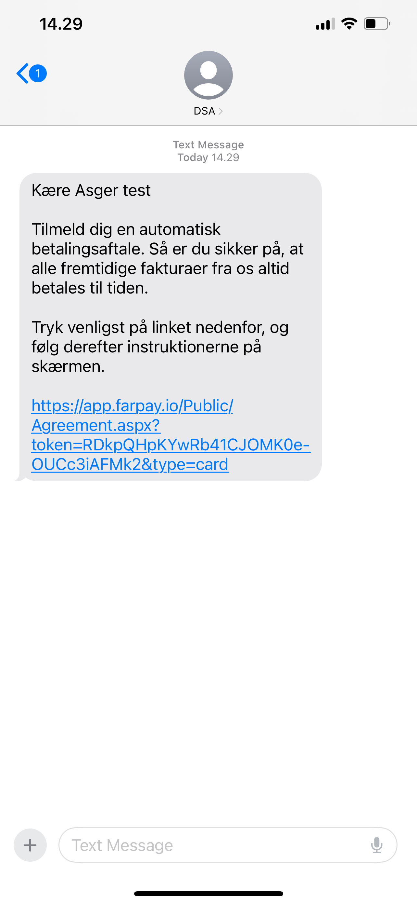
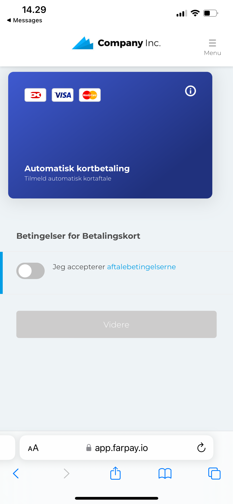
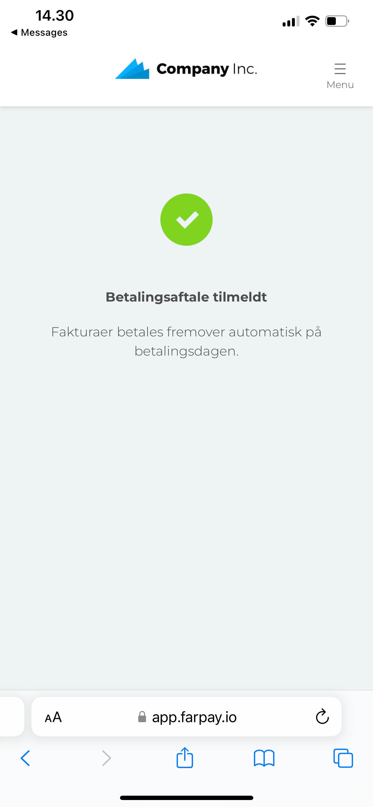

Navigation: [Customers](../Readme.md) / [Customer](Readme.md) /  Agreement Request

<div style="display: inline-block; background-color: #ffc107; color: white; padding: 5px 10px; border-radius: 5px; font-weight: bold;">
  Status: Beta Testing
</div>


# Agreement request 
Give the customer the ability to create an agreement. There are two distribution methods:
* Email
* SMS

## Email request
Send an e-mail to customer `123456` with email address `hans@hansen.dk`

```
    https://farpay-api-staging.azurewebsites.net/v2/customers/123456/agreementRequest?type=card&email=hans%40hansen.dk
```


## SMS Request
Send an SMS to customer `123456` with phone number `+45nnnnnnnn`

```
    https://farpay-api-staging.azurewebsites.net/v2/customers/123456/agreementRequest?type=card&phone=%2B45nnnnnnnn
```

# FLow

Here is a list of thumbnails of the flow of the agreement request.

**Step 1**
Create the request, using the API

**Step 2**
The customer receives an email or SMS with a link to the agreement.



<br><br>

**Step 3**
The customer clicks the link and is redirected to the agreement page. The customer can read the terms and conditions and accept the agreement.



<br><br>

**Step 4**
The customer sees a confirmation message that the agreement has been created.




