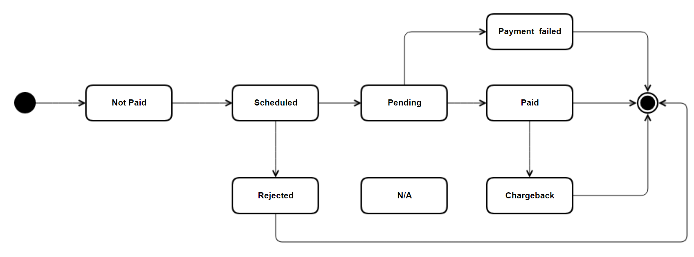

# Invoice
With the invoice endpoint, you can manage the full lifecycle of an invoice, from creation to payment or deletion.
An existin invoice is available from:

```GET https://api.farpay.io/{version}/invoices/{id}```,

where the ```id```, is the unique reference 
to the invoice.

## Endpoints

Here are a list of endpoints, and HTTP-verbs and the operation.


HTTP Verb | Url             |  Description of operation 
----------|-----------------|---------------------------
POST      | /invoices       | Create an invoice, based on an invoice model
GET       | /invoices/{id}  | Single invoice (deep view)
PUT       | /invoices/{id}  | Update invoice with new instructions of how to send the invoice
DELETE    | /invoices/{id}  | Delete an invoice. Set the invoice to be disabled, and not to be processed.
 

# Invoice status
The primary, and main status is the ``invoice.InvoiceStatusId``,  that describes its lifecycle state.

| Status                                           | Description                                                                                                                                      
|:-------------------------------------------------|:-------------------------------------------------------------------------------------------------------------------------------------------------|
| New                                             | The invoice is created, and is not handled by FarPay yet                                                                                         
| Ok                                               | The invoice is ready to be processed.                                                                                                            
| Processing                                       | The invoice is being processed. It is an intermidiatet state, when the invoice is being inserted or processed                                    
| PendingFarPayInvoiceNumber, PendingInvoiceNumber | The invoice is awaiting the next invoice number, that is being generated by FarPay or by the associated accounting system. Typically e-conomic.  
| Error                                            | The invoice is halted, and will not be processed. This state can be forced by calling the DELETE endpoint as mentioned earlier in this document. 
 

# Create an invoice
As you ``POST`` ``https://api.farpay.io/{version}/invoices`` you create an invoice, based on the invoice model.
The invoice model is a complex object, that holds the invoice data, and the invoice lines. The invoice lines are
the products, that are being invoiced. The invoice model is described in the next section.

Her is an example, taken from the SWAGGER document from ``POST`` https://api.farpay.io/swagger/ui/index#!/V2Invoices/V2Invoices_InsertInvoice

`````json
{
  "InvoiceTypeCode": "PIE",
  "InvoiceDate": "2024-02-29"
  "InvoiceAmount": 100,
  "TaxAmount": 25,
  "ToBePaidAmount": 125,
  "Ean": "EAN238273273828"
  "InvoiceNote": "A note to the invoice",
  "InvoiceWasPaidManually": "2024-02-29T20:33:03.022Z", // optional, should be only be set, when the invoice was paid manually
  "InvoiceNumber": "K23119", // If set, it must be unique. In some cases, FarPay or the attached accounting system will generate the number
  "PaymentDueDate": "2024-02-29T20", // The future due date. When "instant" todays date can be used.
  "Currency": "dkk", // Must always be set, DKK is the default for Danish companies. Se more info in the currencies section.
  "Recepient": {  // The customer, that is being invoiced
    "CustomerNumber": "C1234x", // The customer number, if the customer already exists, this number is the only property needed to identify the customer.
    "CompanyNo": "string",
    "Gln": "string",
    "Name": "string",
    "Email": "string",
    "Street": "string",
    "PostCode": "string",
    "PoBox": "string",
    "City": "string",
    "Country": "string",
    "ContactName": "string"
  },
  "SchedulePayment": "Default",
  "PaymentReference": "string",
  "PaymentStatus": "NotPaid",
  "PaymentType": "string",
  "InvoiceStatus": "string",
  "PaymentRejectedBy": "string",
  "PdfInvoice": {
    "Filename": "string",
    "Data": "string"
  },
  "PdfAttachments": [
    {
      "Filename": "string",
      "Data": "string"
    }
  ],
  "InvoiceLines": [
    {
      "LineNumber": 0,
      "ProductNumber": "string",
      "Description": "string",
      "BasePrice": 0,
      "Quantity": 0,
      "UnitCode": "string",
      "DiscountRate": 0,
      "DiscountedPrice": 0,
      "TaxRate": 0,
      "TaxAmount": 0,
      "Amount": 0
    }
  ],
  "TextLines": "string",
  "Template": "string",
  "Send": {
    "Channel": "string",
    "Status": "string",
    "ScheduleSendDate": "2024-02-29T20:33:03.022Z",
    "ToAddress": "string",
    "Note": "string"
  }
}

`````


````JavasScript
{
  "Id": 12345678,
  "InvoiceDate": "23-06-2017",
  "InvoiceAmount": 100,
  "TaxAmount": 0,
  "ToBePaidAmount": 100,
  "Ean": null,
  "InvoiceNote": "",
  "InvoiceFooter": null,
  "InvoiceWasPaidManually": null,
  "Created": "2017-06-23T08:29:36.057",
  "InvoiceNumber": null,
  "PaymentDueDate": "2017-07-03T00:00:00",
  "Currency": "DKK",
  "Recepient": {
    "CustomerNumber": "1570",
    "Name": "Pernille Badenhofen",
    "Email": "pb@company.dk",
    "Street": null,
    "PostCode": null,
    "PoBox": null,
    "City": null,
    "Country": null
  },
  "Schedule": 0,
  "PaymentStatus": 100,
  "SendStatus": 200,
   "PaymentType": "MobilePayInvoice" || "MobilePaySubscriptions" || 
                   "Betalingsservice" || "Leverandørservice" || 
                   "FI" || 
                   "Dankort" || "Visa" || "MasterCard",
  "InvoiceStatus": "Ok",
  "PaymentRejectedBy": null,
  "InvoiceLines": [
    {
      "LineNumber": 0,
      "ProductNumber": "1001",
      "Description": "Vores fantastiske produkt",
      "BasePrice": 100,
      "Quantity": 1,
      "DiscountRate": 0,
      "DiscountedPrice": 0,
      "TaxRate": 0,
      "TaxAmount": 0,
      "Amount": 0
    }
  ],
  "TextLines": "This is a test\nAnd a new line",
  "PdfInvoice": {
    "Filename": "Invoice-1001.pdf",
    "Data": "VBERi0xLjcNCiW1tbW1DQoxIDAgb2JqDQo8PC..."
  },
  "PdfAttachments": [
    {
      "Filename": "Invoice-1001-attachment-01.pdf",
      "Data": "VBERi0xLjcNCiW1tbW1DQoxIDAgb2JqDQo8PC..."
    },
    {
      "Filename": "Invoice-1001-attachment-02.pdf",
      "Data": "VBERi0xLjcNCiW1tbW1DQoxIDAgb2JqDQo8PC..."
    }
  ],
}
````
# Insert invoice
When creating an invoice, the API facilitates two types of invoice-models. A regular invoice, with invoice data and multiple invoice lines data. A creditnote, that also has the same depth of invoice lines that can be refunded. The endpoint is available from an `HTTP_POST` at `https://api.farpay.io/{version}/invoices/`

## Ground rules for creating an invoice
There are a couple of rules, that needs attention before we go into the further details.
* The given amount should always be positive, both on the invoice and in the invoice lines.
* An invoice has the `InvoiceTypeCode`set to  `PIE`
* A creditnote has the `InvoiceTypeCode` set to `PCM`
* Card payments can be done instantly, both payments and creditnotes.
* `PdfInvoice` (optional) can hold your own PDF invoice layout and details. When absent, FarPay standard PDF invoice will be shown.
* `PdfAttachments` (optional), append PDF documents to the PdfInvoice, in order of appearence in the attachment list.
* An existing customer will only be referenced with `CustomerNumber`
* New customer can be created when not identified by the `CustomerNumber` - But it is recommended that the `Customers` `POST` endpoint is used to create new customers.

## Create invoice data

````JavasScript

{
  "InvoiceDate": "2019-08-10",
  "InvoiceAmount": 100,
  "TaxAmount": 25,
  "ToBePaidAmount": 125,
  "Ean": "EAN238273273828",
  "InvoiceNote": "This is a demo note",
  "InvoiceNumber": "OPTIONALNUMBER-123",
  "PaymentDueDate": "2019-10-27",
  "Currency": "DKK",
  "Recepient": {
    "CustomerNumber": "4434"
  },
  "InvoiceLines": [
    {
      "LineNumber": 1,
      "ProductNumber": "T1001",
      "Description": "Test product",
      "BasePrice": 50,
      "Quantity": 2,
      "UnitCode": "stk",
      "DiscountRate": 0,
      "DiscountedPrice": 0,
      "TaxRate": 25,
      "TaxAmount": 12.50,
      "Amount": 125
    }
  ],
  "TextLines": "Textline1\nTextline2 test"
}

````
## Error codes
The error codes, that apply to the endpoint `POST Invoices`:

Code         | Definition               | CTA (Call to action)
-------------|--------------------------|----------------------------------------------------
9000         | API key not set or bad   | Contact support, to get a new valid API key
10000        | Invoice not received     | Comply to the invoice format, mentioned above.
10009        | Invoice number used      | Invoice numbers are unique, and this one is already taken. Please use another one.

Instant errorcodes are elaborated in the instant details, reffered to below.

# Insert invoice for instant payment
When an invoice model is posted into FarPay, the set amount can be withdrawn instantaneously. You will get a synchronous response, indicating if the request completed successfully or not.

Further details on instant payment and error codes are available from the [instant payment details](InvoiceInstantPayment.md)

# Update invoice
The invoice data cannot be updated, but how the invoice is treated in FarPay can be modified by sending a command to the invoice in order to e.g. re-process the invoice.
The endpoint is available from `PUT` at `https://api.farpay.io/{version}/invoices/{invoiceID}`.

Available operations are:

Operation | description
-------------|------------
Queue        | The invoice is placed in start position, and is now treated with the current settings, available from the sender's company
Sent         | Force the invoice to be treated as sent
ReadyToPrint | The invoice is forced to be set to be printed, and since the printjobs run daily, the status will change from print to sent
Error        | The error state, removes the invoice from the invoice workflow and haltes it - no further actions are executed on the invoices. Later changes can occur e.g. to set on Queue.

# Delete Invoice
The invoice can be marked as deleted by invoking endpoint with `DELETE` at `https://api.farpay.io/{version}/invoices/{invoiceID}`.
The delete action, is equivalent to updateing the invoice to `Error`


Garbage!

## Invoice payment state diagram



* ``invoice.SendInvoiceStatusId``, the intermediate state of being scheduled to be sent. Otherwise it
* The payment status is the state of the payment
* The send status is the state of the invoice, and how it is being processed in FarPay.
****