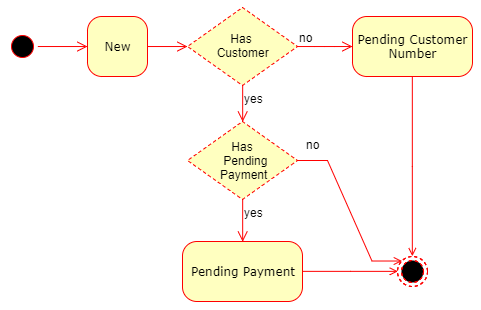

# Orders

The Orders-endpoint is used to manage the creation and maintainance of Agreements and Payments that require a user/customer interaction.

The order is the term, that controls the user-interface-flow, enabling the user to handle the given task at hand. A full screen-to-process flow is found in [FarPay Payment Window](https://github.com/FarPay/PaymentWindow/blob/master/README.md). 

To have a user create a new Agreement or Payment, you must first create an `Order` by posting a model to this endpoint. The returned result is an `Order`-result model, that includes a unique Token to reference the `Order`, and  the `UserInputUrl` to the Payment Window. 

Subsequently after the order has been created, the user must be redirect to this Payment Window, specified in the `UserInputUrl`.

Now, after the user completion of the Agreement and/or the Payment, in the PaymentWindow, the user will be redirected back the the `AcceptUrl` that was defined when creating the Order. If the user cancels the process before it is compleated, FarPay will redirect the user to the `CancelUrl`.

The invoice endpoint `https://api.farpay.io/{version}/orders` gives you access to all your orders, and their state. Use Case scenarios are:
* List orders with optional status filter
* Single order (deep view)
* Create an order
* Update the order (With customer data)

**Remark!** that [all requests must have](All-Requests.md) an `X-API-KEY` and `Accept` mentioned in the header requests.

# Order status


State                 | value | Brief description
----------------------|-------|------------------------------------------------
New                   | 100   | Initial state
PendingPayment        | 200   | When a payment as been received and matches the invoice 
PendingCustomerNumber | 300   | The customer has an agreement, and the invoice will be marked as scheduled
Ok                    | 400   | The scheduled payment is now being processed
Error                 | 500   | The payment is being rejected by user, creditor or financial institution
Canceled              | 600   | The amount is charged back, as the monitary transaction is reversed by creditor or finansial institution
Expired               | 700   | Paymnet failed of various causes such as, agreement was removed, or due to low account balance

# Get all orders
The endpoint is available from an`HTTP_GET` at `https://api.farpay.io/{version}/orders`, and can be filtered statusvalues mentioned in the table above.

Here is an example of a collection with an order - Remark that this is an example presented in JSON, and that the data can be presented as SOAP XML if requested...

````javascript
[
  {
    "Token": "abc123",
    "ExternalID": "your reference",
    "AcceptUrl": "https://companyName.com/acceptUrl",
    "CancelUrl": "https://companyName.com/cancelUrl",
    "CallbackUrl": "https://companyName.com/callbackUrl",
    "Lang": "en",
    "Customer": {
       "CustomerNumber": "1234567890",
       "CustomerName": "Customer Name",
       "CustomerEmail": "email@address.com"
    },
    "Payment": {
      "Amount": 49.95,
      "Currency": "DKK",
      "Description": "First half month payment",
      "Reference": "YourPaymentReference"
    }
  }
]
````
Property | Description | Valid values
---------|-------------|--------------
Token    | FarPay unique token to the order | `string`
ExternalID | Your domain reference to the order in FarPay | `string`
AcceptUrl | Url, when the order is successfully completed | `string`
CancelUrl | Url, when the user cancels the order | `string`
CallbackUrl | Url for delivery data when the user completes the registration | `string`
Lang | Language specification can be `en` for english, `da` for danshh, `fo` for faroese | `string`
CustomerNumber | Customer number | `string`
CustomerName | Name (first and last) of the customer | `string`
CustomerEmail | Customer E-mail | `string`
Payment-Amount | Payment with . seperator for decimals | `decimal`
Payment-Currency | Currency in standard ISO 4217 format | `string`
Payment-Description | Describe what the customer is paying for | `string`
Payment-Reference | Your domain reference to the payment | `string`

# Single order
Get an `Order`-object, based on a `Token` from an `HTTP_GET` at `https://api.farpay.io/{version}/orders/{token}`
The order properties are the same as mentioned in the property table above.

# Create order
When creating an Order, there are two properties that will manage the outcome of how the PaymentWindow render. First is the precence of an agreement that will hold the values:
* 0 - Meaning not applicable
* 1 - Required
* 2 - Optional

Second property is the `PaymentType` that can reduce the flow options accordingly. When not specified, all available PaymentTypes will be exposed as valid options.
A reduction can be specified with a commaseperated string with the wanted payment types:

```
  PaymentTypes = 'bs,card'
```
For Betalingsservice and MobilePay.

The available paymentTypes filters are:
* bs - Betalingsservice
* ls - Leverandørservice
* mp - MobilePay (both MobilePay Invoice and MobilePay Subscriptions)
* card - Dankort, Visa and/or MasterCard.

A `Payment` can also be You can also be include inside the Order, where you specify an Amount and Currency.

An Order can have the following combinations of Agreement and Payment:

Scenario  | Agreement                    | Payment                        | No payment
----------|------------------------------|--------------------------------|----------------
1         | Agreement not applicable (0) | Single Payment                 |  N/A
2         | Agreement required (1)       | Create Agreement and Payment   | Create Agreement
3         | Agreement optional (2)       | Payment and optional Agreement |  N/A

A new `Order` can be created an `HTTP_POST` at `https://api.farpay.io/{version}/orders`.
The order is created, and returned with a `Token`, as well as a link to the form, that the user can input the payment information in.

Here are the examples, from the scenarios above:

## Scenario 1: Create order for a payment
This scenario should be used, when the customer should pay an amout, and not create an agreement.

A JSON payload:
````javascript
{
  "ExternalID": "DOMAIN_REFERENCE-002",
  "AcceptUrl": "https://myCompany.com/accept",
  "CancelUrl": "https://myCompany.com/cancel",
  "CallbackUrl": "https://myCompany.com/callback",
  "Lang": "da",
  Agreement: 0,
  "Customer": {
     "CustomerNumber": "999918",
     "CustomerName": "My name and lastname",
     "CustomerEmail": "person@myCompany.dk"
  },
  "Payment": {
    "Amount": 4.50,
    "Currency": "DKK",
    "Description": "Betaling for den første måned",
    "Reference": "DOMAIN_BETALING_123456"
  }
}
````

## Scenario 2: The agreement required, with a payment
This scenario covers two scenarios. In both cases the agreement is required, but in the first, the payment is required too.

**JSON Payload, required agreement and required payment**

This is typically used when the customer must create an agreemement, as well as handling a payment - In some cases the initial payment.

````javascript
{
  "ExternalID": "DOMAIN_REFERENCE-002",
  "AcceptUrl": "https://myCompany.com/accept",
  "CancelUrl": "https://myCompany.com/cancel",
  "CallbackUrl": "https://myCompany.com/callback",
  "Lang": "da",
  "Agreement": 1,
  "Customer": {
     "CustomerNumber": "999918",
     "CustomerName": "My name and lastname",
     "CustomerEmail": "person@myCompany.dk"
  },
  "Payment": {
    "Amount": 4.50,
    "Currency": "DKK",
    "Description": "Betaling for den første måned",
    "Reference": "DOMAIN_BETALING_123456"
  }
}
````

**JSON Payload, required agreement and no payment:**

This typically holds the scenario, where the customer must create an agreement only.

````javascript
{
  "ExternalID": "DOMAIN_REFERENCE-002",
  "AcceptUrl": "https://myCompany.com/accept",
  "CancelUrl": "https://myCompany.com/cancel",
  "CallbackUrl": "https://myCompany.com/callback",
  "Lang": "da",
  "Agreement": 1,
  "Customer": {
     "CustomerNumber": "999918",
     "CustomerName": "My name and lastname",
     "CustomerEmail": "person@myCompany.dk"
  }
}
````

## Scenario 3: Optional Agreement and Payment
This scenario plays out when there is an amout that must be paid. The user is presented with the option, in addition to the payment, also to create an agreement.
````javascript
{
  "ExternalID": "DOMAIN_REFERENCE-002",
  "AcceptUrl": "https://myCompany.com/accept",
  "CancelUrl": "https://myCompany.com/cancel",
  "CallbackUrl": "https://myCompany.com/callback",
  "Lang": "da",
  "Agreement": 2,
  "Customer": {
     "CustomerNumber": "999918",
     "CustomerName": "My name and lastname",
     "CustomerEmail": "person@myCompany.dk"
  },
  "Payment": {
    "Amount": 4.50,
    "Currency": "DKK",
    "Description": "Betaling for den første måned",
    "Reference": "DOMAIN_BETALING_123456"
  }
}
````
## Result (all scenarios above)
Bear in mind that this result represent all the scenarios where the agreement can be present as an optional or a mandatory property, to that the Payment is only present when initially requested.

````Javascript
{
  "Status": "New | PendingPayment | PendingCustomer | Ok | Error | Canceled | Expired",
  "Token": "<token>",
  "ExternalID": "DOMAIN_REFERENCE-002",
  "AcceptUrl": "https://myCompany.com/accept",
  "CancelUrl": "https://myCompany.com/cancel",
  "CallbackUrl": "https://myCompany.com/callback",
  "UserInputUrl": "https://app.farpay.io/payment/<token>",
  "Lang": "da",
  "PaymentTypes": "Mp,Invoice,Bs",
  "Agreement": 0 | 1 | 2,
  "Customer": {
     "CustomerNumber": "999918",
     "CustomerName": "My name and lastname",
     "CustomerEmail": "person@myCompany.dk"
  },
  "Payment": {
    "Amount": 4.50,
    "Currency": "DKK",
    "Description": "Betaling for den første måned",
    "Reference": "DOMAIN_BETALING_123456"
  },
  "Created": "2018-10-30T10:36:09.115Z"
}
````

# Update Order
For clarity, earlier examples the `Customer` was included in the [Create Order](#create-order) documentation above. But in fact, the customer is not required to be known at the point when the `Order` is created.

In these scenarios, the domain system will have the customer information later on the process, and can therefore also propergate these information to the order for final completion.
In this state (`Pending Customer Number`), which means that the order might be comleted with the user interaction, relating to both payment and creating an agreement, it still lacks the actual customer. This endpoint provides exactly that!
When the customer is updated, the order is processed as planned. The agreement data, and the paymentdata (if any) are propergated into the formal model and structure of a `Customer`, `Agreement` and `Payment` when applickable in the order.

The endpoint is available as a `HTTP_PUT` from `https://api.farpay.io/{version}/orders` where the the order must contain a customer, that can be formalized into a strong type customer.
The values, that are received are:
* CustomerNumber
* CustomerName
* CustomerEmail

```
{
  "Token": "<token>",
  "Customer": {
    "CustomerNumber": "999918",
    "CustomerName": "My name and lastname",
    "CustomerEmail": "person@myCompany.dk"
  }
}
````
