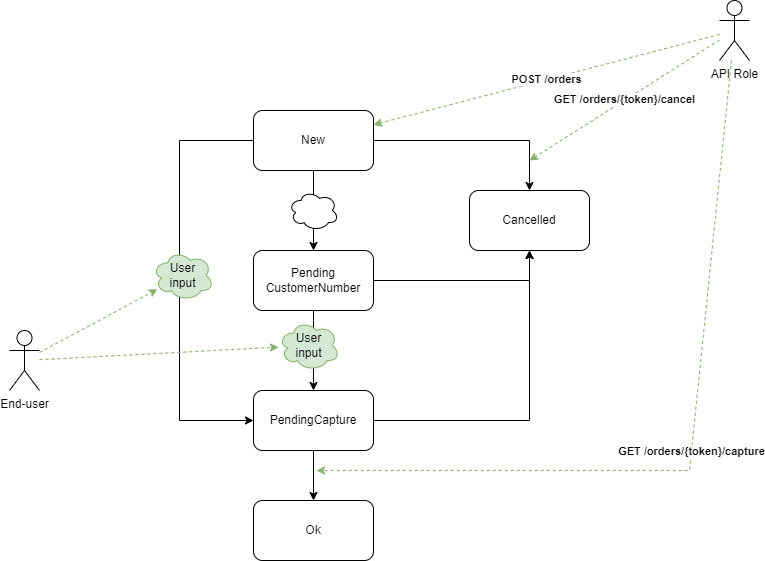

navigate: [ApiDoc](../Readme) / [Release notes](Readme.md) / API-Release-v2-2023-04-001

# API-Release-v2-2023-10-001
This document describes the release of FarPay API v2, 11th of October 2023

## Document history

| state           | author             | timestamp   | description                                                                                 |
|-----------------|--------------------|-------------|---------------------------------------------------------------------------------------------|
| Initial version | @theodorjohannesen | 2023-oct-11 | Initial version                                                                             |
| Changes         | @theodorjohannesen | 2023-oct-11 | Added the `AutoCapture` property to the `POST` /Orders endpoint                             |
| Added diagram   | @theodorjohannesen | 2023-oct-12 | Added diagram to illustrate the new paymentflow + further details to existing documentation |

# Release state
Release information in the table below.

| Value            | description                                  |
|------------------|----------------------------------------------|
| Environment      | `Staging`                                    |
| ApiUrl           | https://farpay-api-staging.azurewebsites.net |
| WebAppUrl        | https://fapayprod-staging.azurewebsites.net  |
| Expected release | 18th of October                              |

## Version control TAG

| Value  | description                           |
|--------|---------------------------------------|
| Tag    | `API-v.2.1.2`                         | 
| Commit | `9879e33`                             |
| By     | Theodor E. Johannesen (tej@farpay.dk) |
| Date   | 2023-oct-11                           |


## Feedback
If you have any comments, please reachout to support@farpay.dk, titled `API-Release-v2-2023-10-001`.

## About
The release, holds following changes

1. `Capture` Order endpoint
2. `Cancel` Orders endpoint 
3. `Delveries` endpoint can handle large files

### Diagram Overview
This diagram represent and overview of both Capture and Cancel endpoints, that facilitate
the introduced payment flow for `AutoCapture=false` feature


### Breaking changes.
No breaking changes will occur!

We are introducing a new property `AutoCapture` in the `POST` /Orders endpoint,
where the order will result in a `PendingCapture` as a final state, awaiting capture event 
from the `GET` `´/orders`.


# 1. New Capture endpoint
Create a new order from `POST` /Orders, where the request with a Payment-property 
`AutoCapture` is set to false.

## Example:
Introducing the payment.AutoCapture property, where the default value is set to `true` to comply
with existing code. An explicit change to false, will introduce the new diverging paymentflow, 
where the order will be created with a `PendingCapture` status after the card information has been given
by the enduser.

```javascript
    {
        ...
        "Payment": {
            "AutoCapture": false,
            "Amount": 100.00,
            "Currency": "DKK",
            "PaymentReference" : "EX-123456"
        }
        ...
    }
```
To investigate further, please attend to [Capture Orders](../Orders/OrdersCapture.md) for further details.

# 2. New Cancel endpoint
As for orders, that have the states of `PendingCapture` or `PendingCustomerNumber`, the order can be cancelled.
A cancellation will roll-back all previous events, tied to the order, including a payment and/or an agreement

To investigate further, please attend to [Cancel Orders](../Orders/OrdersCapture.md#cancelling-an-order) for further details.

# 3. Deliveries endpoint
Now there are two ways of creating a delivery. One is with a base64 file, and the other is with a file-upload.

### With a base64 file
In the common scenario, a Base64 file is attached as a `string` to the file-node. Example:
```javascript
{
  "DeliveryType": "Invoice",
  "DeliveryFormat": "XML",
  "File": {
    "Filename": "MyFile.xml",
    "Data": "ewogICJKb2IiID...ayBvciB0ZWpAZmFycGF5LmRrIgp9"
  }
} 
```
Where the response is a confirmation of receiving the file:

```javascript
{
  "Id": 12345678,
  "Created": "2023-04-14T09:21:44.270Z",
  "DeliveryType": "Invoice",
  "DeliveryStatus": "New",
  "ErrorMessage": "<when an error, it is written here>",
  "FileUploadUri": "null"
}

```

### With no file
When no filedata is set, the result is an url, that can be used, to upload the file to.

```javascript
{
  "DeliveryType": "Invoice",
  "DeliveryFormat": "XML",
  "File": {
    "Filename": "MyFile.xml",
    "Data": null
  }
}
  
```
Where the response is a confirmation of receiving the file:

```javascript
{

  "Id": 88460475,
  "Created": "2023-04-14T13:09:40.0750166+00:00",
  "DeliveryType": "FarPayXmlType",
  "DeliveryStatus": "PendingFile",
  "ErrorMessage": null,
  "FileUploadUri": "https://farpay.blob.core.windows.net/deliverytemp/1236f5ed-78a4-4934-9404-f0e8c582ef64?sv=2020-08-04&spr=https&se=2023-04-14T13:39:40Z&sr=b&sp=cw&sig=LPfLFrCvl3A7I3ldD7bH7K/KVAgNJs3MEbi82/jgxkY="

}
```
**Upload the file**
1. Grab the url in `FileUploadUri`
2. Get hold of your file
3. Read the binary content of the file
4. Set the header `x-ms-blob-type`: `blockblob`
5. `PUT` binary content to the url.
6. Received an HTTP Created (201)

You have now completed an upload, and the file will now be processed accordingly.
In order to see the orderstatus, You can always request the status of the order in
the `GET` `Orders/{id}` endpoint.


```
Cheers from FarPay devteam!
This is coded with ❤️ and ☕.

DIdrIksen, Pet11r, 4h0rur and tHe0d0r.
```
